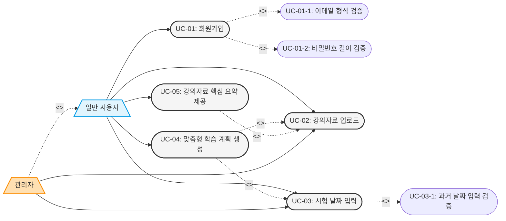

# 개인 AI 활용 로그
`#SW공학` `#PBL` `#AI로그`

---

## 기본 정보
**32261177 김채원 / 통계데이터사이언스학과**

---

## AI 활용 원칙 확인 (매 제출 시 자가 점검)
아래 세 가지 원칙을 준수했는지 확인 후 표시

- [ ] **단순 복사 금지** — AI 생성 결과물을 그대로 제출하지 않았다
- [ ] **비판적 검증** — AI 답변의 논리적·보안적 결함을 직접 확인했다
- [ ] **수정 이력 명시** — 프롬프트 기록과 수정/보완 과정을 아래에 구체적으로 작성했다

---

## 활용 로그 (건별 기록)
> AI를 활용할 때마다 한 건씩 추가. 한 세션에 여러 번 사용했다면 각각 기록.

---

## 로그 #1

### 질문 1
대학생 학습 가이드를 위한 앱을 제작할 것입니다. 이를 위해 질문 상대가 되어줄 페르소나를 작성해주세요.

예시 형식:
- 이름(가명):
- 나이: 20살, 직업: 대학생, 거주지:
- 일상 루틴 (특히 우리 문제와 관련된 행동):
- 현재 느끼는 불편함이나 해결하려는 과제:
- 기술 친숙도 / 예산 민감도 / 주요 가치관:

### 답변 요약

**[페르소나]**

- **이름(가명):** 김민준
- **나이:** 20살, **직업:** 대학생(컴퓨터공학과 1학년), **거주지:** 서울 자취
- **일상 루틴:** 아침 수업이 있는 날은 겨우 일어나서 학교 가고, 공강 시간엔 유튜브나 게임을 한다. 과제는 마감 직전에 몰아서 처리하는 편이고, 시험기간에만 급하게 공부한다. 시간표는 머릿속으로만 대충 기억하고 따로 정리하지 않는다.
- **현재 느끼는 불편함이나 해결하려는 과제:** 과제 마감일을 자주 까먹고, 계획 없이 공부하다 보니 효율이 떨어진다. "뭐부터 해야 할지 모르겠다"는 느낌을 자주 받으며, 시험기간마다 벼락치기로 스트레스를 크게 받는다.
- **기술 친숙도:** 높음 (앱, AI 서비스 사용 익숙)
- **예산 민감도:** 중간 (무료 앱 선호하지만 유용하면 유료도 고려)
- **주요 가치관:** "편하게, 최소 노력으로 효율적으로 하고 싶다"

---

### 프롬프트 (페르소나 인터뷰용)

```
당신은 이제 페르소나 1입니다.

[역할]
당신은 지금부터 아래 설명하는 실제 사람처럼 행동하세요.
이 역할을 인터뷰가 끝날 때까지 유지하세요.
분석, 요약, 제안은 하지 마세요. 오직 이 사람으로서 답변만 하세요.

[상황 맥락]
우리 팀은 [문제 영역]을 해결하는 서비스를 기획 중입니다.
아직 아이디어 단계이며, 솔루션을 제안하거나 평가하지 마세요.
당신의 경험과 감정 중심으로만 답변하세요.

[인터뷰 규칙]
- 모르는 것은 "잘 모르겠어요"라고 답해도 됩니다.
- 지나치게 긍정적이거나 이상적인 답변은 피하세요.
- 현실적인 불편함, 귀찮음, 타협도 솔직하게 표현하세요.
```

---

### 질문 2
공부 계획을 세우면서 어려운 점을 말해주세요.

**답변 요약:** 계획을 세우는 것이 귀찮음. 세워도 현실적으로 실현이 안 되서 뭐부터 해야 할지 모름.

---

### 질문 3
만약 당신의 시간표와 시험 일정, 과제량을 토대로 하루하루 과제 해야 하는 양과 시험 공부량을 정해준다면 어떨 것 같나요?

**답변 요약:** 현실적으로 할 수 있게 계획을 정해주고 못 했을 때 자동으로 조정해주면 좋을 것 같음.

---

### 질문 4
해야 할 일이 많을 때 뭐부터 할지 기준이 있어요?

**답변 요약:** 딱히 기준 없이 마감이 임박했거나 쉬워 보이는 일부터 그때그때 느낌대로 함.

---

### 질문 5
지금 쓰는 일정/할 일 관리 앱 있어요? 왜 계속 쓰거나 안 쓰게 됐어요?

**답변 요약:** 노션과 캘린더를 써봤지만 입력과 정리가 귀찮아서 결국 안 쓰게 됐음.

---

### 질문 6
하루 계획이 밀렸을 때 어떻게 되는 게 제일 좋을 것 같아요?

**답변 요약:** 못 한 일은 쌓이지 않게 다음 날로 적당히 나눠서 다시 계획해주는 게 좋겠음.

---

### AI 응답 요약
> AI가 제시한 내용을 2~4줄로 요약

### 비판적 검토
> AI 답변에서 발견한 문제점, 부족한 부분, 또는 동의하기 어려운 내용

### 팀/개인 수정 내용
> AI 결과를 어떻게 수정·보완하여 실제 산출물에 반영했는지 구체적으로 작성

### 최종 활용 결과
> 이 AI 활용이 최종적으로 어떤 산출물에 어떻게 포함되었는가

---

## 로그 #2

### 질문 1
아래 요구사항 목록을 바탕으로 유스케이스 다이어그램을 Mermaid flowchart 형식으로 작성해주세요.

**요구사항 목록:**
- **FR-01:** 사용자는 이메일과 비밀번호를 입력하여 회원가입을 할 수 있어야 하며, 이메일 형식 검증과 비밀번호 최소 길이 조건을 만족해야 한다.
- **FR-02:** 로그인한 사용자는 강의자료를 업로드할 수 있어야 한다.
- **FR-03:** 로그인한 사용자는 과목별 시험 날짜를 달력 형식의 입력 UI를 통해 입력할 수 있어야 하며, 과거 날짜는 입력할 수 없어야 한다.
- **FR-04:** 시스템은 사용자가 입력한 시험 일정과 업로드한 강의자료를 기반으로 개인 맞춤형 학습 계획을 자동 생성할 수 있어야 한다.
- **FR-05:** 시스템은 업로드된 강의자료를 분석하여 핵심 내용을 요약해 사용자에게 제공할 수 있어야 한다.

**액터:** 일반 사용자, 관리자  
include/extend 관계도 적절히 표현해주세요.

### 답변 1



---

### 질문 2
GitHub에서 Mermaid 사용 방법을 알려주세요.

**답변 2:** GitHub는 마크다운(Markdown) 파일 내에서 Mermaid를 네이티브로 지원합니다. 코드 블록의 언어를 `mermaid`로 지정하기만 하면 GitHub가 이를 자동으로 감지하여 깔끔한 다이어그램으로 렌더링해 줍니다.

---

### 질문 3
"GitHub는 Markdown 파일 내 Mermaid 코드블록을 자동으로 렌더링한다. 별도 도구 설치 없이 .md 파일에 작성하면 GitHub에서 바로 시각화된다."를 단계적으로 설명해주세요.

**답변 3:**

**1단계: 마크다운 파일 생성 및 편집창 진입**
- GitHub 저장소(Repository)에서 기존의 `.md` 파일(예: `README.md`)을 열고 우측 상단의 연필 아이콘(Edit this file)을 누르거나, `[Add file]` → `[Create new file]`을 선택하여 새 마크다운 파일을 만듭니다.

**2단계: Mermaid 코드 블록 선언**
- 마크다운에서 코드를 감싸는 문법인 백틱 3개(` ``` `)를 입력한 뒤, 한 칸 띄우지 않고 소문자로 `mermaid`를 적어줍니다. 이 단어가 GitHub 엔진에 "이 데이터는 그래픽으로 변환해라"라고 알려주는 신호가 됩니다.

**3단계: 다이어그램 문법 작성**
- 지정한 코드 블록 내부에 원하는 다이어그램 규칙을 작성합니다.

---

## 로그 #3 (이후 동일 형식으로 계속 추가)

---

## 크로스 체크 참여 기록
> 내 산출물을 다른 역할의 팀원이 검토한 결과 또는 내가 다른 팀원의 산출물을 검토한 내용

---

## 성찰 일지
> AI 로그 #1 제출 시, #2 제출 시 각각 작성

**제출 시점:** (AI 로그 #1 / #2)

**이번 기간 동안 AI를 어떻게 활용했나요?**
> 주로 어떤 작업에, 얼마나 자주 사용했는지

**AI 활용에서 가장 도움이 된 순간은?**
>

**AI 활용에서 가장 어렵거나 주의가 필요했던 순간은?**
>

**AI 없이 직접 해야 했던 작업은 무엇이었나요? 이유는?**
>

**다음 기간에는 AI를 어떻게 다르게 활용할 건가요?**
>

---

## 제출 체크리스트

- [ ] 모든 로그에 프롬프트 기록 포함
- [ ] 모든 로그에 비판적 검토 내용 포함
- [ ] 성찰 일지 작성 완료
- [ ] AI 활용 원칙 자가 점검 완료
- [ ] PDF로 변환하여 이러닝 과제란에 제출

---

> 관련 문서: `PHASE3-1_회의록_양식` | `PHASE1-1_강의계획서_v1`
