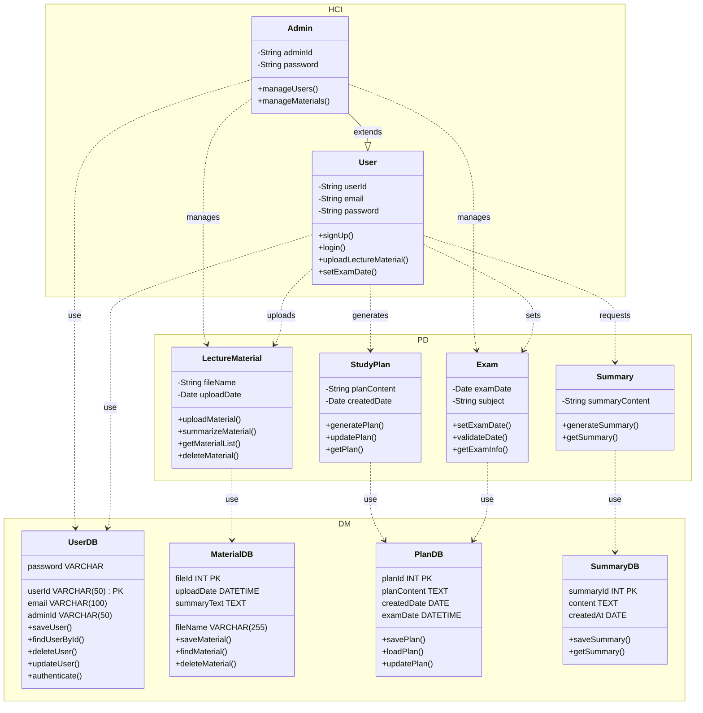

```mermaid
classDiagram
  namespace HCI {
    class User {
      -String userId
      -String email
      -String password
      +signUp()
      +login()
      +uploadLectureMaterial()
      +setExamDate()
    }
    class Admin {
      -String adminId
      -String password
      +manageUsers()
      +manageMaterials()
    }
  }

  namespace PD {
    class LectureMaterial {
      -String fileName
      -Date uploadDate
      +uploadMaterial()
      +summarizeMaterial()
      +getMaterialList()
      +deleteMaterial()
    }
    class Exam {
      -Date examDate
      -String subject
      +setExamDate()
      +validateDate()
      +getExamInfo()
    }
    class StudyPlan {
      -String planContent
      -Date createdDate
      +generatePlan()
      +updatePlan()
      +getPlan()
    }
    class Summary {
      -String summaryContent
      +generateSummary()
      +getSummary()
    }
  }

  namespace DM {
    class UserDB {
      userId VARCHAR(50) PK
      email VARCHAR(100)
      password VARCHAR
      adminId VARCHAR(50)
      +saveUser()
      +findUserById()
      +deleteUser()
      +updateUser()
      +authenticate()
    }
    class MaterialDB {
      fileId INT PK
      fileName VARCHAR(255)
      uploadDate DATETIME
      summaryText TEXT
      +saveMaterial()
      +findMaterial()
      +deleteMaterial()
    }
    class PlanDB {
      planId INT PK
      planContent TEXT
      createdDate DATE
      examDate DATETIME
      +savePlan()
      +loadPlan()
      +updatePlan()
    }
    class SummaryDB {
      summaryId INT PK
      content TEXT
      createdAt DATE
      +saveSummary()
      +getSummary()
    }
  }

  %% HCI 내부 관계
  Admin --|> User : extends

  %% HCI → PD 의존
  User ..> LectureMaterial : uploads
  User ..> Exam : sets
  User ..> StudyPlan : generates
  User ..> Summary : requests
  Admin ..> LectureMaterial : manages
  Admin ..> Exam : manages

  %% PD → DM 의존
  LectureMaterial ..> MaterialDB : use
  Exam ..> PlanDB : use
  StudyPlan ..> PlanDB : use
  Summary ..> SummaryDB : use
  User ..> UserDB : use
  Admin ..> UserDB : use
```
```
