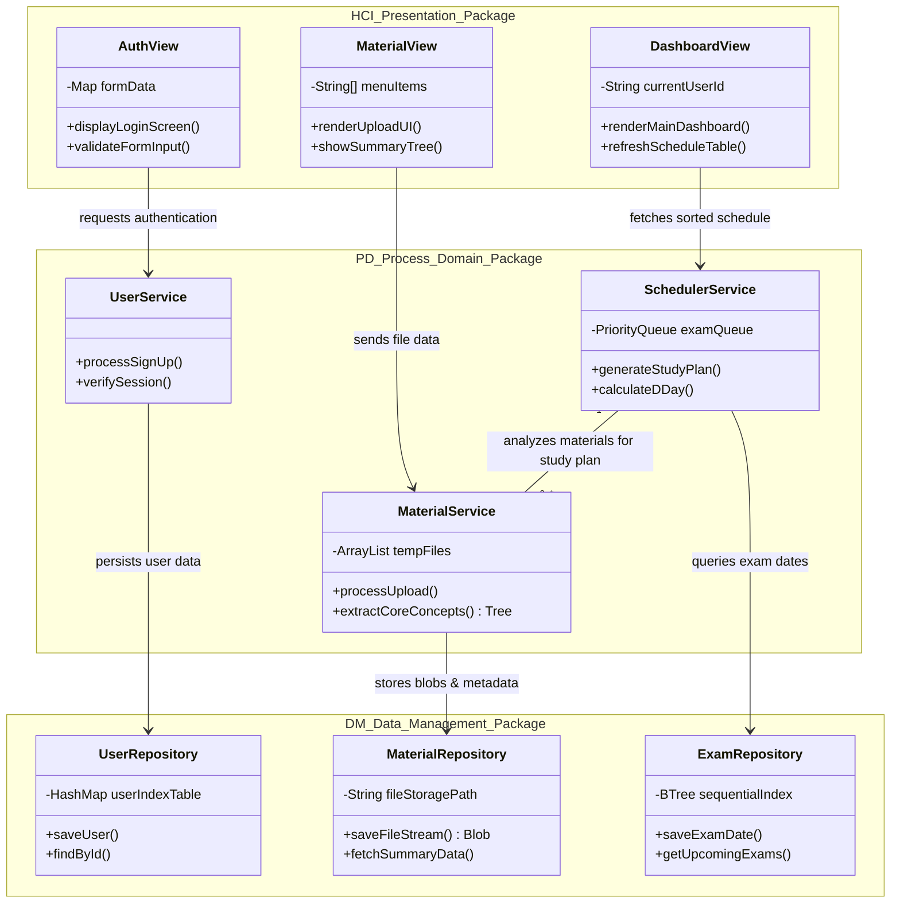

```mermaid
classDiagram
    %% [HCI Layer Package]
    namespace HCI_Presentation_Package {
        class AuthView {
            -Map formData
            +displayLoginScreen()
            +validateFormInput()
        }
        class MaterialView {
            -String[] menuItems
            +renderUploadUI()
            +showSummaryTree()
        }
        class DashboardView {
            -String currentUserId
            +renderMainDashboard()
            +refreshScheduleTable()
        }
    }

    %% [PD Layer Package]
    namespace PD_Process_Domain_Package {
        class UserService {
            +processSignUp()
            +verifySession()
        }
        class MaterialService {
            -ArrayList tempFiles
            +processUpload()
            +extractCoreConcepts() Tree
        }
        class SchedulerService {
            -PriorityQueue examQueue
            +generateStudyPlan()
            +calculateDDay()
        }
    }

    %% [DM Layer Package]
    namespace DM_Data_Management_Package {
        class UserRepository {
            -HashMap userIndexTable
            +saveUser()
            +findById()
        }
        class MaterialRepository {
            -String fileStoragePath
            +saveFileStream() Blob
            +fetchSummaryData()
        }
        class ExamRepository {
            -BTree sequentialIndex
            +saveExamDate()
            +getUpcomingExams()
        }
    }

    %% --------------------------------------------------------
    %% 관계 정의 (Relationship - 이미지의 표기법 가이드라인 준수)
    %% --------------------------------------------------------

    %% HCI -> PD 레이어 간의 호출 및 의존 관계 (Directed Association / Dependency)
    AuthView --> UserService : requests authentication
    MaterialView --> MaterialService : sends file data
    DashboardView --> SchedulerService : fetches sorted schedule

    %% PD -> DM 레이어 간의 데이터 영속성 처리 (Directed Association)
    UserService --> UserRepository : persists user data
    MaterialService --> MaterialRepository : stores blobs & metadata
    SchedulerService --> ExamRepository : queries exam dates

    %% 서비스 간의 협력 및 참조 관계 (Association)
    SchedulerService "1" -- "0..*" MaterialService : analyzes materials for study plan
```
