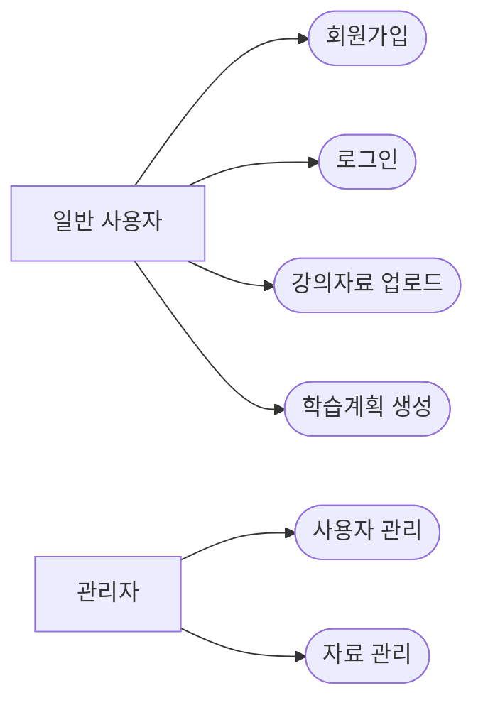
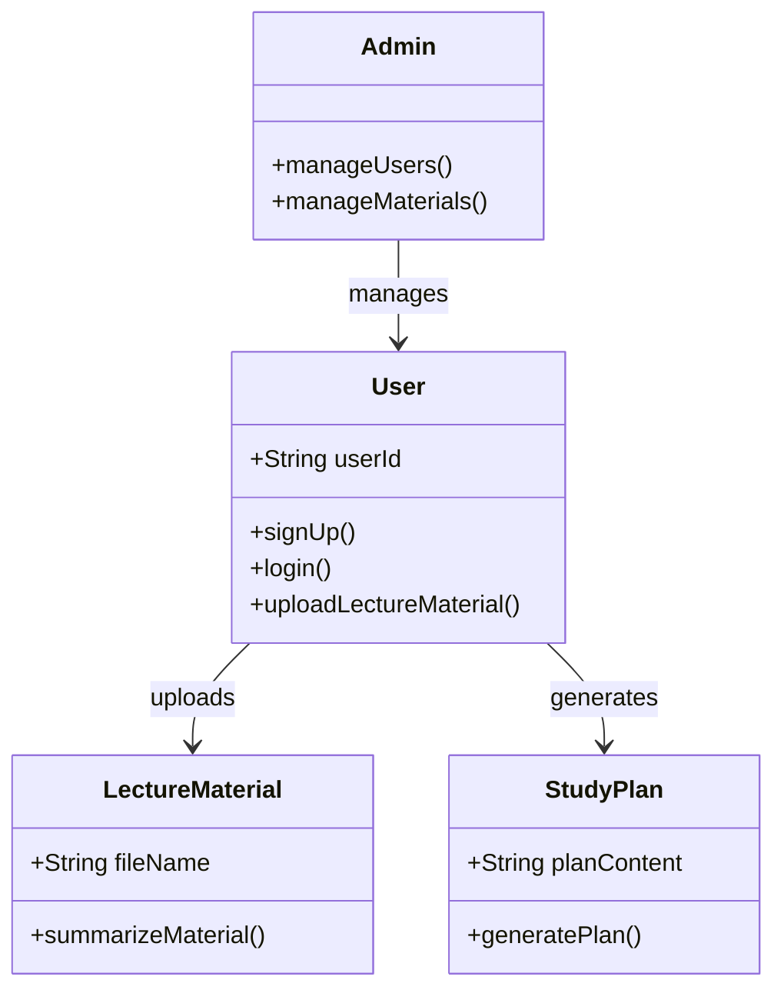

# M1 요약 및 변경 이력

**주 작성자:** 방주원(PM) | **부 작성자:** 김연재(분석가)

## M1 핵심 요약
대학생의 학습 효율 증대를 위해 시험 일정과 강의 자료를 기반으로 맞춤형 학습 계획을 자동 생성하는 시스템입니다. 주요 기능으로 회원 관리, 자료 업로드 및 AI 요약, 개인화된 학습 계획 생성을 제공합니다.

## 변경 이력

| 변경 일자 | 항목 | 변경 전 | 변경 후 | 변경 사유 |
| :--- | :--- | :--- | :--- | :--- |
| 11주차 | 시스템 기능 | 사용자 기능 위주 | 관리자(Admin) 기능 추가 | 운영 효율성 및 데이터 관리 보강 |
| 11주차 | 아키텍처 | 단순 서버 구조 | 비동기 메시지 큐 구조 도입 | 성능(10초 이내 생성) 요구사항 준수 |

---

# UML 다이어그램

**주 작성자:** 김예성(설계자) | **부 작성자:** 김연재(분석가)

## 2-1. 유스케이스 다이어그램
요구사항(FR)과 1:1 대응하며, 액터(일반 사용자, 관리자)의 권한을 명확히 구분하였습니다.

## 2-2. 클래스 다이어그램
시스템의 구조를 명확히 하고, 속성과 메서드를 포함하여 클래스 간 관계를 정의하였습니다.

---

# 3. 설계 패턴 적용 내역

**주 작성자:** 김예성(설계자), 김주함(개발자) | **부 작성자:** 김채원(QA/보안)

**패턴 이름:** 싱글톤 패턴 (Singleton Pattern)

**선택 이유:** DB 연결 객체(DBConnectionManager)가 무분별하게 생성되는 것을 방지하여 리소스 낭비와 연결 초과 오류를 차단하기 위함입니다.

**적용 내용:** private 생성자와 getInstance() 메서드를 통해 전역에서 단 하나의 인스턴스만 공유되도록 리팩토링하였습니다.

---

# 4. SOLID 원칙 검토

**주 작성자:** 김예성(설계자) | **부 작성자:** 김채원(QA/보안)

- **SRP (단일 책임 원칙):** LectureMaterial 클래스의 요약/알림 책임을 Summary 클래스와 NotificationService로 분리하여 각 클래스의 역할을 명확히 하였습니다.

- **OCP (개방-폐쇄 원칙):** 알림 방식(이메일, 앱 푸시 등)을 인터페이스로 정의하여, 향후 새로운 기능 추가 시 기존 코드 수정 없이 클래스 확장만으로 대응 가능하도록 설계하였습니다.

- **LSP (리스코프 치환 원칙):** 자식 클래스(AdminUser 등)가 부모 클래스(User)를 대체하더라도 시스템이 정상적으로 동작하도록 설계하여 객체지향 안정성을 확보하였습니다.

---

# 5. 다음 단계 계획

**주 작성자:** 방주원(PM) | **부 작성자:** 전원

- **Cross-check:** 역할 교환 방식을 통해 팀원 전원이 각자의 산출물을 검토하고 용어 및 구조 일관성을 최종 확보할 계획입니다.

- **성능 및 보안 최적화:** 설계 단계의 리스크를 바탕으로 구현 중간 단계에서 성능(10초 이내 생성) 및 보안(암호화/권한 제어) 집중 테스트를 진행합니다.

- **M3 최종 보고서 연계:** 구현 완료 후 설계-구현 간 일치 여부를 검증하고 최종 성과를 정리하여 M3 최종 보고서에 반영할 예정입니다.
