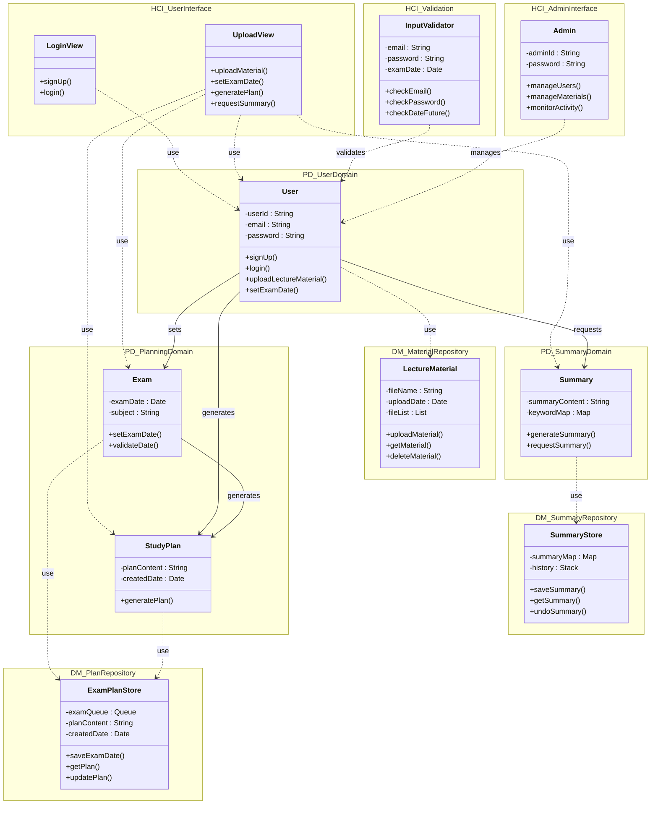

```mermaid
classDiagram
direction TB

%% HCI Layer
namespace HCI_UserInterface {
    class LoginView {
        +signUp()
        +login()
    }
    class UploadView {
        +uploadMaterial()
        +setExamDate()
        +generatePlan()
        +requestSummary()
    }
}
namespace HCI_Validation {
    class InputValidator {
        -email : String
        -password : String
        -examDate : Date
        +checkEmail()
        +checkPassword()
        +checkDateFuture()
    }
}
namespace HCI_AdminInterface {
    class Admin {
        -adminId : String
        -password : String
        +manageUsers()
        +manageMaterials()
        +monitorActivity()
    }
}

%% PD Layer
namespace PD_UserDomain {
    class User {
        -userId : String
        -email : String
        -password : String
        +signUp()
        +login()
        +uploadLectureMaterial()
        +setExamDate()
    }
}
namespace PD_PlanningDomain {
    class Exam {
        -examDate : Date
        -subject : String
        +setExamDate()
        +validateDate()
    }
    class StudyPlan {
        -planContent : String
        -createdDate : Date
        +generatePlan()
    }
}
namespace PD_SummaryDomain {
    class Summary {
        -summaryContent : String
        -keywordMap : Map
        +generateSummary()
        +requestSummary()
    }
}

%% DM Layer
namespace DM_MaterialRepository {
    class LectureMaterial {
        -fileName : String
        -uploadDate : Date
        -fileList : List
        +uploadMaterial()
        +getMaterial()
        +deleteMaterial()
    }
}
namespace DM_PlanRepository {
    class ExamPlanStore {
        -examQueue : Queue
        -planContent : String
        -createdDate : Date
        +saveExamDate()
        +getPlan()
        +updatePlan()
    }
}
namespace DM_SummaryRepository {
    class SummaryStore {
        -summaryMap : Map
        -history : Stack
        +saveSummary()
        +getSummary()
        +undoSummary()
    }
}

%% HCI → PD
LoginView      ..> User     : use
UploadView     ..> User     : use
UploadView     ..> Exam     : use
UploadView     ..> StudyPlan : use
UploadView     ..> Summary  : use
InputValidator ..> User     : validates
Admin          ..> User     : manages

%% PD 내부
User --> Exam      : sets
User --> StudyPlan : generates
User --> Summary   : requests
Exam --> StudyPlan : generates

%% PD → DM
User      ..> LectureMaterial : use
Exam      ..> ExamPlanStore   : use
StudyPlan ..> ExamPlanStore   : use
Summary   ..> SummaryStore    : use
```
